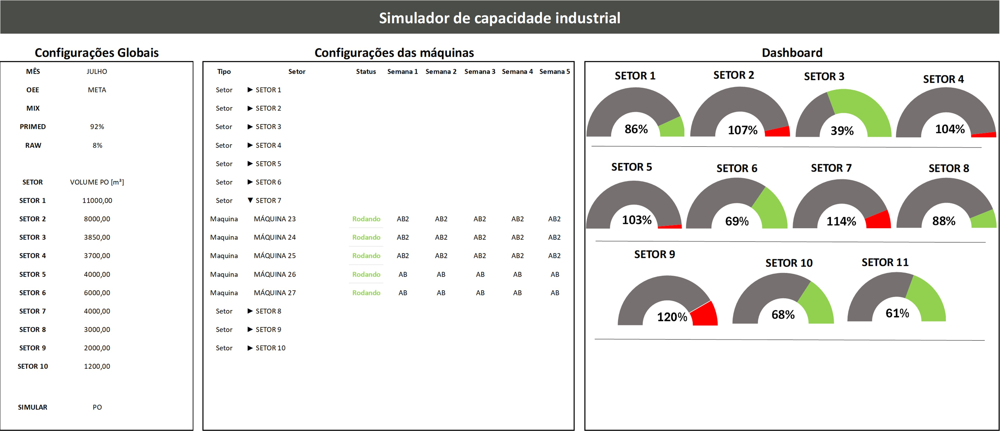
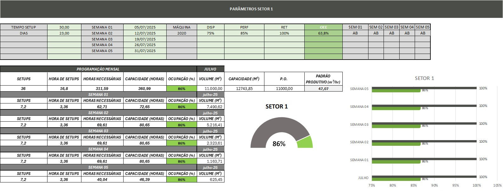

# Especificação Técnica Detalhada: Simulador de Carga Máquina (Versão Refatorada)

### 1. Objetivo e Arquitetura do Sistema

#### 1.1. Objetivo
O **Simulador de Carga Máquina** é uma aplicação de software desenvolvida em Microsoft Excel, projetada para fornecer ao Planejamento e Controle da Produção (PCP) uma ferramenta robusta para análise de capacidade e otimização da alocação de recursos. O sistema processa a carteira de pedidos, calcula a carga horária em cada centro de custo e reprograma automaticamente a produção para respeitar as restrições de capacidade, permitindo simulações de múltiplos cenários.

#### 1.2. Arquitetura Modular
A aplicação opera sobre uma arquitetura modular de quatro camadas, que separa as responsabilidades, garante a manutenibilidade e facilita futuras expansões:

1.  **Motor de Dados (ETL - Power Query):** A única porta de entrada de dados brutos. É responsável por extrair, limpar e estruturar todas as informações de engenharia de fontes externas em um formato tabular padronizado.
2.  **Motor de Regras (Tabelas de Configuração):** O cérebro centralizado do sistema. Todas as regras de negócio, parâmetros, roteiros de fabricação e mapeamentos residem em tabelas dedicadas do Excel, tornando a lógica transparente e facilmente editável pelo usuário.
3.  **Motor de Cálculo (Fórmulas Dinâmicas):** Uma camada de cálculo em tempo real, composta por fórmulas eficientes (`PROCX`, `SOMASES`) que leem os dados estruturados (do Motor de Dados) e aplicam as lógicas (do Motor de Regras) para determinar cargas, tempos e classificações.
4.  **Motor de Otimização (VBA Generalizado):** Um conjunto enxuto e inteligente de código VBA que executa a lógica de simulação e reprogramação. O código é agnóstico às regras de negócio, pois as consulta diretamente do Motor de Regras.

---

### 2. Motor de Dados: ETL com Power Query (`Base_1`)

A consulta no Power Query é responsável por processar o arquivo de engenharia `ena3005.xlsx`.

* **Lógica de Transformação:** A consulta implementa um padrão de **Unpivot/Pivot** para normalizar a estrutura de dados de entrada:
    1.  **Seleção e Unpivot:** Todas as colunas de processo genéricas (ex: `Grp Máquina 01` a `13`, `Item 01` a `13`, `Qtd Comp. 01` a `13`) são selecionadas e transformadas de colunas para linhas (`Unpivot`).
    2.  **Limpeza e Extração:** O texto da coluna de atributos é tratado para extrair o nome do processo ("Grp Máquina", "Item", "Qtd Comp.") e o índice numérico.
    3.  **Pivot:** A tabela é novamente pivotada, usando os nomes dos processos como as novas colunas.
* **Saída:** O resultado é uma tabela única e limpa na aba `Base_1`, onde cada linha representa um item de um pedido e as colunas representam de forma explícita os processos produtivos pelos quais ele passa (ex: `Perfiladeira`, `Lixadeira`, `Primed`), junto com a quantidade e o código do subitem correspondente.

---

### 3. Motor de Regras: Configuração Centralizada

Esta camada elimina a lógica "escondida" em código ou fórmulas complexas, tornando o sistema transparente e gerenciável.

#### 3.1. Aba `CONFIG_VBA`
Esta tabela é a ponte entre o código VBA e a estrutura da planilha. O Motor de Otimização a consulta para saber como e onde encontrar as informações de roteirização para cada processo.

| Processo | AbaRoteiro | ColFamilia | ColSubfamilia | RangeOpcoes | TipoBusca |
| :--- | :--- | :--- | :--- | :--- | :--- |
| Moldureiras | ROTEIROS | E | F | G:J | Padrão |
| Primer | ROTEIROS | E | F | K:M | Padrão |
| Fita de Desdobro | ROTEIROS | E | F | N:U | Simples |
| Linha Integrada | ROTEIROS | E | F | G:M | Composta |
| *Novo Processo* | *...* | *...* | *...* | *...* | *...* |

* **Função das Colunas:**
    * `Processo`: Nome do centro de custo.
    * `AbaRoteiro`: Nome da aba onde está a matriz de roteiros.
    * `Col...`: Letra da coluna para busca por família/subfamília.
    * `RangeOpcoes`: O intervalo de colunas que contém as máquinas alternativas.
    * `TipoBusca`: Um parâmetro que define como o VBA deve tratar a busca (ex: "Padrão", "Simples" para uma lista direta, ou "Composta" para lógicas especiais como a da Linha Integrada).

#### 3.2. Aba `MAPEAMENTOS`
Esta aba substitui todas as fórmulas `SE` gigantes e aninhadas para classificação de produtos.

* **Tabela `TabelaSubfamilia`:**
| Tipo | Subfamilia |
| :---| :--- |
| BASE | A |
| CASING | C |
| ... | ... |

* **Tabela `TabelaFamilia`:**
| LarguraMin | LarguraMax | Familia |
| :--- | :--- | :--- |
| 0 | 40 | 1 |
| 40.1 | 60 | 2 |
| ... | ... | ... |

**Benefício:** As regras de classificação são agora dados, não código. Adicionar um novo tipo de produto é simplesmente adicionar uma nova linha a uma tabela.

#### 3.3. Aba `ROTEIROS_UNIFICADOS`
Esta aba consolida todas as matrizes de roteiro (`RDF`, `MATRIZ MOLD`, etc.) em um único local, formatado como uma Tabela do Excel chamada `TabelaRoteiros`.

| Processo | Familia | Subfamilia | Prioridade | Opcao_1 | Opcao_2 | Opcao_3 | ... |
| :--- | :--- | :--- | :--- | :--- | :--- | :--- | :--- |
| Moldureiras | 1 | A | MOLDUREIRA | 2093 | 2092 | 2091 | |
| Moldureiras | 1 | A | LINHA INTEGRADA| 2136 | 2137 | | |
| Primer | 1 | A | PRIMER | 2131 | 2132 | 2133 | |
| ... | ... | ... | ... | ... | ... | ... | ... |

---

### 4. Motor de Cálculo: Fórmulas Dinâmicas (`Aba Painel`)

A aba `Painel` utiliza fórmulas enxutas e legíveis que se baseiam no Motor de Regras.

* **Fórmula de Subfamília:**
    `=PROCX([@TIPO]; TabelaSubfamilia[Tipo]; TabelaSubfamilia[Subfamilia]; "N/A")`

* **Fórmula de Máquina Padrão (Exemplo para Moldureira):**
    `=FILTRO(TabelaRoteiros[Opcao_1]; (TabelaRoteiros[Processo]="Moldureiras") * (TabelaRoteiros[Familia]=[@Familia]) * (TabelaRoteiros[Subfamilia]=[@Subfamilia]) * (TabelaRoteiros[Prioridade]="MOLDUREIRA"); "N/A")`

---

### 5. Motor de Otimização: VBA Generalizado

O código VBA foi completamente refatorado para ser um motor de lógica puro, livre de parâmetros hard-coded.

#### 5.1. Sub `ReprogramarMaquinas` (O Orquestrador)
Esta é a macro principal. Sua responsabilidade é simples:
1.  Limpar as reprogramações anteriores.
2.  Iterar sobre cada ordem de produção na aba `PROGRAMACAO`.
3.  Para cada processo da ordem, verificar a ocupação da máquina padrão.
4.  Se a ocupação > 100%, ela chama a função `EncontrarMaquinaAlternativa`, passando os dados da ordem.
5.  Se a função retornar uma máquina válida, ela é escrita na célula de reprogramação.

#### 5.2. Function `EncontrarMaquinaAlternativa` (O "Cavalo de Batalha")
Esta é a única função responsável por encontrar rotas alternativas. Ela é chamada por todos os processos.
* **Assinatura:** `Function EncontrarMaquinaAlternativa(Processo As String, Familia As String, Subfamilia As String, Semana As Integer) As String`
* **Lógica de Execução:**
    1.  Recebe o nome do `Processo` (ex: "Primer").
    2.  Consulta a aba `CONFIG_VBA` para encontrar a linha correspondente ao "Primer", obtendo o nome da aba de roteiro, as colunas de busca e o range das máquinas alternativas.
    3.  Acessa a `TabelaRoteiros` na aba `ROTEIROS_UNIFICADOS`.
    4.  Filtra essa tabela para encontrar a(s) linha(s) que correspondem à `Familia` e `Subfamilia` do produto.
    5.  Itera pela lista de máquinas alternativas (`Opcao_1`, `Opcao_2`, ...) encontradas.
    6.  Para cada máquina alternativa, consulta a aba `OCUPACAO` para verificar a carga na `Semana` correta.
    7.  **Retorna o código da primeira máquina cuja ocupação for <= 100%.**
    8.  Se nenhuma máquina for encontrada, retorna uma string vazia ("").

---

### 6. Benefícios da Arquitetura Implementada

* **Manutenibilidade:** Alterações em regras de negócio, roteiros ou adição de novas máquinas são feitas em tabelas do Excel, sem a necessidade de editar código VBA ou fórmulas complexas.
* **Escalabilidade:** Adicionar um novo centro de custo ao simulador resume-se a adicionar entradas nas tabelas de configuração e criar sua respectiva aba de cálculo, sem quebrar a lógica existente.
* **Clareza e Rastreabilidade:** A lógica do sistema é transparente. Para entender por que uma máquina foi escolhida, basta consultar as tabelas de roteiro e configuração.
* **Confiabilidade:** A eliminação de código duplicado e fórmulas aninhadas reduz drasticamente a probabilidade de erros e inconsistências.
